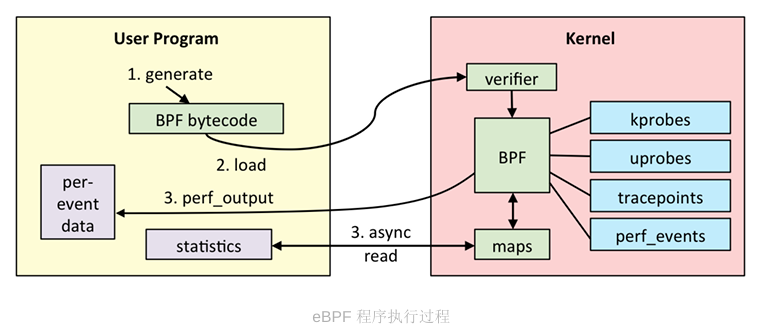
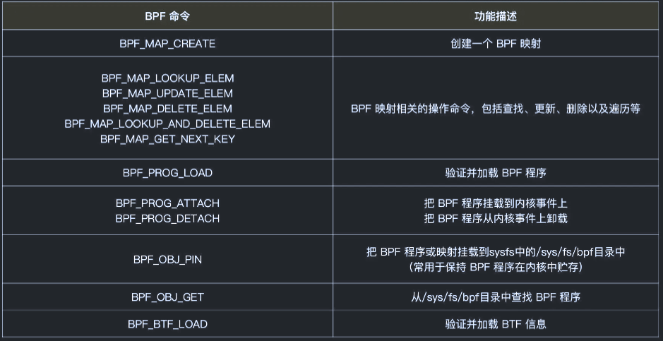
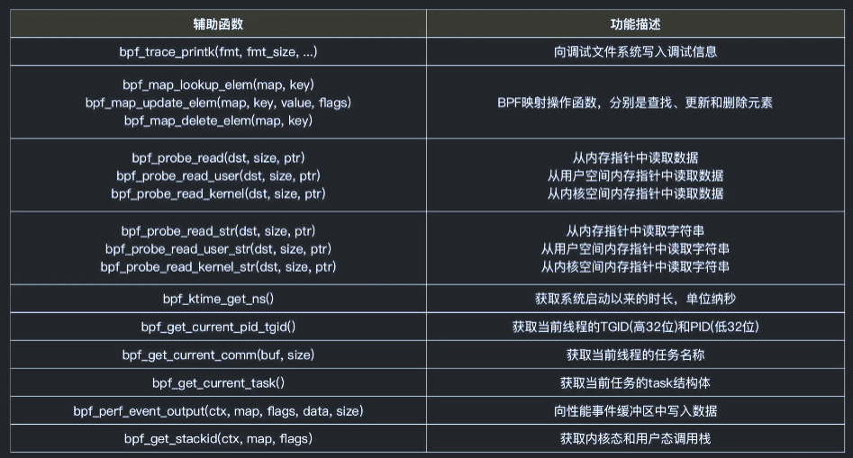
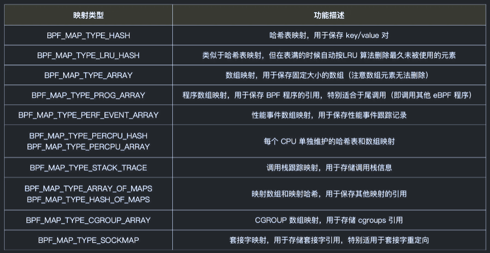
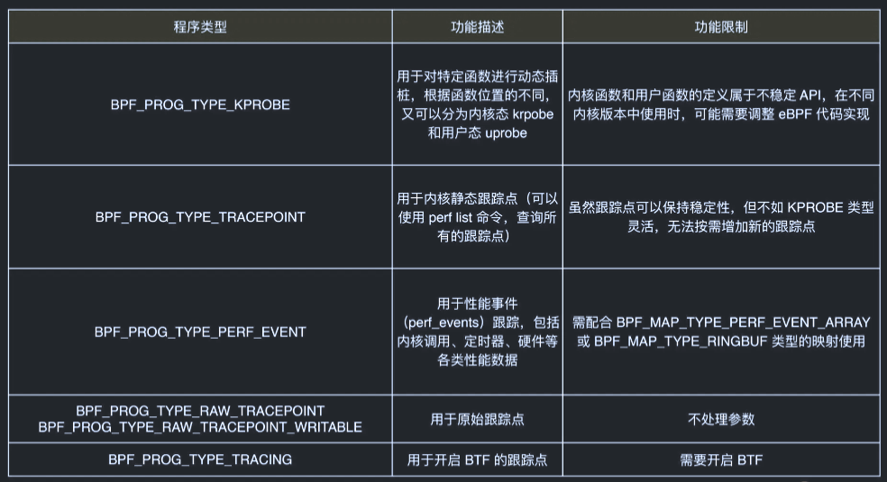
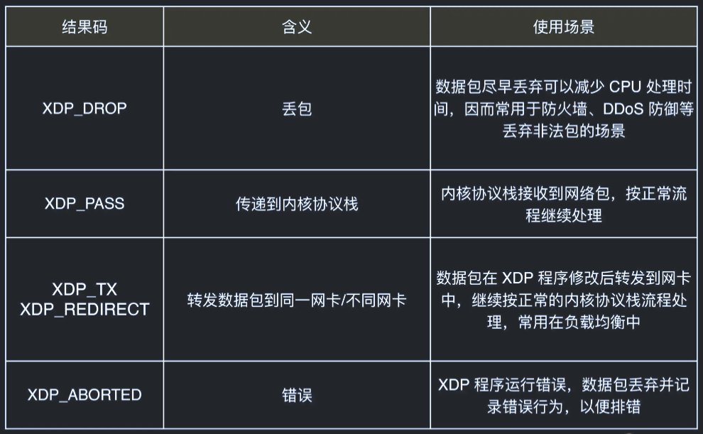
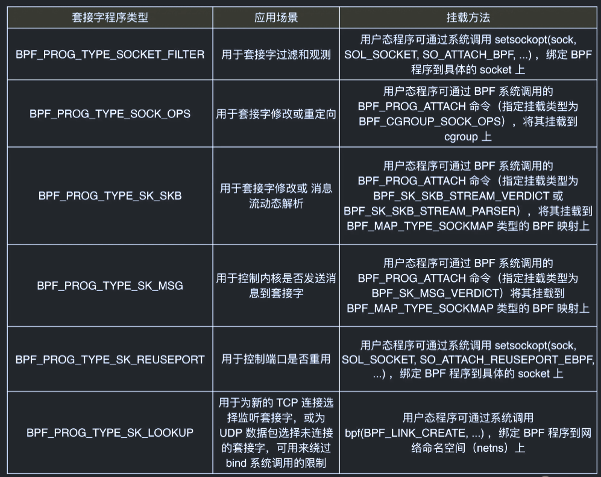
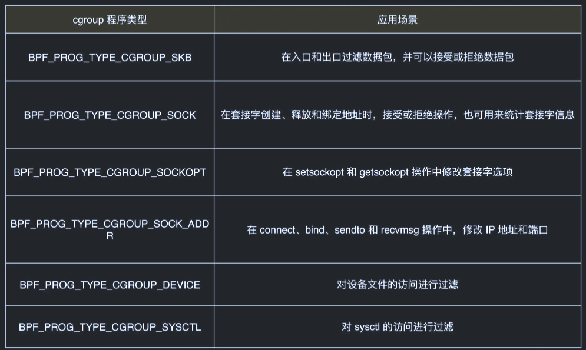
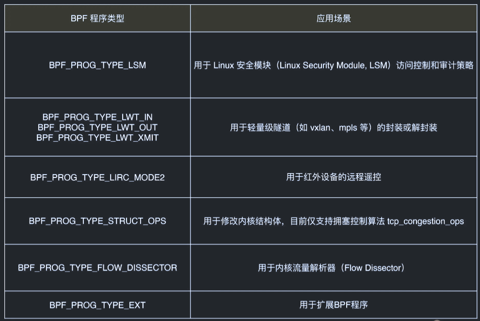

<!--
 * @Author: star-cs
 * @Date: 2025-07-28 16:34:29
 * @LastEditTime: 2025-07-28 20:46:14
 * @FilePath: /ebpf-learning/README.md
 * @Description: 
-->
# ebpf-learning
ebpf 学习笔记

# eBPF 环境安装
```bash
sudo apt-get install -y  make clang llvm libelf-dev libbpf-dev bpfcc-tools

# libbpf 源码安装
```

# eBPF 开发 执行过程
- C语言写一个 eBPF 程序
- LLVM 把 eBPF 程序编译成 BPF 字节码
- 通过 bpf 系统调用，把 BPF 字节码提交给内核
- 内核验证并允许 BPF 字节码，并把相应的状态保存到 BPF 映射中
- 用户程序通过 BPF 映射查询 BPF 字节码的允许状态



# BCC（BPF Compiler Collection）
- 使用 C 开发一个 eBPF 程序
- 使用 Python 和 BCC 库开发一个用户态程序
- 执行 eBPF 程序

# eBPF 虚拟机


# bpftool
```base
git clone --recurse-submodules https://github.com/libbpf/bpftool.git
cd bpftool/src
sudo make install
```


```bash
bpftool prog list # 查询系统中正在运行的 eBPF 程序
```
```
  27: kprobe  name hello_world  tag 38dd440716c4900f  gpl
         loaded_at 2025-07-28T17:21:23+0800  uid 0
         xlated 104B  jited 82B  memlock 4096B
         btf_id 26
         pids python3(35149)
```

```bash
bpftool prog dump xlated id 27
```
```
int hello_world(void * ctx):
; int hello_world(void* ctx)
   0: (b7) r1 = 33
; ({ char _fmt[] = "Hello, World!"; bpf_trace_printk_(_fmt, sizeof(_fmt)); });
   1: (6b) *(u16 *)(r10 -4) = r1
   2: (b7) r1 = 1684828783
   3: (63) *(u32 *)(r10 -8) = r1
   4: (18) r1 = 0x57202c6f6c6c6548
   6: (7b) *(u64 *)(r10 -16) = r1
   7: (bf) r1 = r10
; 
   8: (07) r1 += -16
; ({ char _fmt[] = "Hello, World!"; bpf_trace_printk_(_fmt, sizeof(_fmt)); });
   9: (b7) r2 = 14
  10: (85) call bpf_trace_printk#-82848
; return 0;
  11: (b7) r0 = 0
  12: (95) exit
```

# eBPF 程序是什么时候执行?
```bash
sudo strace -v -f -ebpf ./BCC/hello.py
```
> chmod +x ./BCC/hello.py

# BPF 系统调用
其中,用户态负责 eBPF 程序的加载、事件绑定以及 eBPF 程序运行结果的汇总输出;  
内核态运行在 eBPF 虚拟机中,负责定制和控制系统的运行状态。

对于用户态程序来说,我想你已经了解,它们与内核进行交互时必须要通过系统调用来完成。

BPF 系统调用的调用格式
```c
#include <linux/bpf.h>  
int bpf(int cmd, union bpf_attr *attr, unsigned int size);
```
- cmd，代表操作命令,比如上一讲中我们看到的 BPF_PROG_LOAD 就是加载 eBPF 程序;  
- attr，代表 bpf_attr 类型的 eBPF 属性指针,不同类型的操作命令需要传入不同的  属性参数;
- size，代表属性的大小。




# BPF 辅助函数
例如，bpf_trace_printk() 是最常用的一个辅助函数,用于向调试文件系统(/sys/kernel/debug/tracing/trace_pipe)写入调试信息。



> 这其中,需要你特别注意的是以 `bpf_probe_read` 开头的一系列函数。我在上一讲中已经提到,eBPF 内部的内存空间只有寄存器和栈。所以,要访问其他的内核空间或用户空间地址,  就需要借助 `bpf_probe_read` 这一系列的辅助函数。这些函数会进行安全性检查,并禁止  缺页中断的发生。而在 eBPF 程序需要大块存储时,就不能像常规的内核代码那样去直接分配内存了,而是必须  通过 BPF 映射(BPF Map)来完成。

# BPF 映射

BPF 映射用于提供大块的键值存储,这些存储可被用户空间程序访问,进而获取 eBPF 程序的运行状态。eBPF 程序最多可以访问 64 个不同的 BPF 映射,并且不同的 eBPF 程序也可以通过相同的 BPF 映射来共享它们的状态。

BPF 映射只能通过用户态程序的系统调用来创建
```c
int bpf_create_map(enum bpf_map_type map_type, unsigned int key_size,  unsigned int value_size, unsigned int max_entries) 
{  
    union bpf_attr attr = {  
        .map_type = map_type,  
        .key_size = key_size,  
        .value_size = value_size,  
        .max_entries = max_entries  
    };  
    return bpf(BPF_MAP_CREATE, &attr, sizeof(attr));  
}
```
查看系统支持的 BPF 映射类型
```bash
bpftool feature probe | grep map_type
```



BCC 库，使用预定义的宏来简化 BPF 映射的创建过程   
例如：哈希表映射 `BPF_HASH(name, key_type=u64,  leaf_type=u64, size=10240)` 
```c
// 使用默认参数 key_type=u64, leaf_type=u64, size=10240  
BPF_HASH(stats);  

// 使用自定义key类型,保持默认 leaf_type=u64, size=10240  
struct key_t {  char c[80];  };
BPF_HASH(counts, struct key_t);

// 自定义所有参数  
BPF_HASH(cpu_time, uint64_t, uint64_t, 4096);
```

BPF 系统调用中并没有删除映射的命令，BPF 映射会在用户态程序关闭文件描述符的时候自动删除(即close(fd) )。
如果你想在程序退出后还保留映射,就需要调用 `BPF_OBJ_PIN` 命令,将映射挂载到 /sys/fs/bpf 中。

# BPF 类型格式 (BTF)
BCC 在编译 eBPF 程序时,需要从内核头文件中找  到相应的内核数据结构定义。这样,你在调用 bpf_probe_read 时,才能从内存地址中提取  到正确的数据类型。

从内核 5.2 开始,只要开启了 CONFIG_DEBUG_INFO_BTF,在编译内核时,内核数据结构的定义就会自动内嵌在内核二进制文件 vmlinux 中。
```bash
bpftool btf dump file /sys/kernel/btf/vmlinux format c > vmlinux.h
```
> 开发 eBPF 程序时只需要引入一个 vmlinux.h 即可

# 思考题：你是如何理解 BPF 系统调用和 BPF 辅助函数的?
BPF 系统调用  用户态  
作为用户态程序与内核交互的唯一系统级入口，通过 bpf() 系统调用完成 eBPF 程序的加载、事件挂载以及映射创建和更新
  
BPF 辅助函数  内核态  
eBPF 程序运行在内核态但无法直接调用内核函数，辅助函数（Helper Functions）提供了一组安全的中间层 API，用于受限访问内核功能或数据


# 1 跟踪类 eBPF 程序
跟踪类 eBPF 程序主要用于从系统中提取跟踪信息,进而为监控、排错、性能优化等提供数据支撑。  
比如,我们前几讲中的 Hello World 示例就是一个 BPF_PROG_TYPE_KPROBE 类型的跟  踪程序,它的目的是跟踪内核函数是否被某个进程调用了。


> KPROBE、TRACEPOINT 以及 PERF_EVENT 都是最常用的 eBPF 程序类型,大量  应用于监控跟踪、性能优化以及调试排错等场景中。

# 2 网络类 eBPF 程序
网络类 eBPF 程序主要用于对网络数据包进行过滤和处理,进而实现网络的观测、过滤、流量控制以及性能优化等各种丰富的功能。

根据事件触发位置的不同,网络类 eBPF 程序又可以分为 XDP(eXpress Data Path,高速数据路径)程序、TC(Traffic Control,流量控制)程序、套接字程序以及 cgroup 程序,下面我们来分别看看。

## XDP 程序
XDP 程序的类型定义为 BPF_PROG_TYPE_XDP,它在网络驱动程序刚刚收到数据包时触发执行。由于无需通过繁杂的内核网络协议栈,XDP 程序可用来实现高性能的网络处理方案,常用于 DDoS 防御、防火墙、4 层负载均衡等场景。
> XDP 程序并不是绕过了内核协议栈,它只是在内核协议栈之前处理数据包,而处理过的数据包还可以正常通过内核协议栈继续处理。

根据网卡和网卡驱动是否原生支持 XDP 程序,XDP 运行模式可以分为下面这三种:
- 通用模式。它不需要网卡和网卡驱动的支持,XDP 程序像常规的网络协议栈一样运行在内核中,性能相对较差,一般用于测试; 
- 原生模式。它需要网卡驱动程序的支持,XDP 程序在网卡驱动程序的早期路径运行;  
- 卸载模式。它需要网卡固件支持 XDP 卸载,XDP 程序直接运行在网卡上,而不再需要消耗主机的 CPU 资源,具有最好的性能。

无论哪种模式,XDP 程序在处理过网络包之后,都需要根据 eBPF 程序执行结果,决定数据  包的去处。这些执行结果对应以下 5 种 XDP 程序结果码:



XDP 程序通过 ip link 命令加载到具体的网卡上,加载格式为:
```bash
# eth1 为网卡名  
# xdpgeneric 设置运行模式为通用模式  
# xdp-example.o 为编译后的 XDP 字节码  
sudo ip link set dev eth1 xdpgeneric object xdp-example.o
```
而卸载 XDP 程序也是通过 ip link 命令,具体参数如下:
```bash
sudo ip link set veth1 xdpgeneric off
```

除了 ip link之外, BCC 也提供了方便的库函数,让我们可以在同一个程序中管理 XDP 程序的生命周期:
```python
from bcc import BPF

b = BPF(src_file="xdp-example.c")
fn = b.load_func("xdp_pass", BPF.XDP)

dev = "eth1"
b.attach_xdp(dev, fn, 0)

... 

b.remove_xdp(dev)
```

## TC 程序
TC 程序的类型定义为 BPF_PROG_TYPE_SCHED_CLS 和 BPF_PROG_TYPE_SCHED_ACT,分  别作为 Linux 流量控制 的分类器和执行器。

同 XDP 程序相比,TC 程序可以直接获取内核解析后的网络报文数据结构sk_buff(XDP 则  是 xdp_buff),并且可在网卡的接收和发送两个方向上执行(XDP 则只能用于接收)。


> 由于 TC 运行在内核协议栈中,不需要网卡驱动程序做任何改动,因而可以挂载到任意类型的网卡设备(包括容器等使用的虚拟网卡)上。

TC eBPF 程序也可以通过 Linux 命令行工具来加载到网卡上
```bash
# 创建 clsact 类型的排队规则  
sudo tc qdisc add dev eth0 clsact  
# 加载接收方向的 eBPF 程序  
sudo tc filter add dev eth0 ingress bpf da obj tc-example.o sec ingress  # 加载发送方向的 eBPF 程序  
sudo tc filter add dev eth0 egress bpf da obj tc-example.o sec egress
```

## 套接字程序
套接字程序用于过滤、观测或重定向套接字网络包,具体的种类也比较丰富。根据类型的不  同,套接字 eBPF 程序可以挂载到套接字(socket)、控制组(cgroup )以及网络命名空间  (netns)等各个位置。


## cgroup 程序
cgroup 程序用于对 cgroup 内所有进程的网络过滤、套接字选项以及转发等进行动态控制, 它最典型的应用场景是对容器中运行的多个进程进行网络控制。

> 这些类型的 BPF 程序都可以通过 BPF 系统调用的 BPF_PROG_ATTACH 命令来进行挂载,并  设置挂载类型为匹配的 BPF_CGROUP_xxx 类型。

> 比如,在挂载  BPF_PROG_TYPE_CGROUP_DEVICE 类型的 BPF 程序时,需要设置 bpf_attach_type 为  BPF_CGROUP_DEVICE:
```c
union bpf_attr attr = {};  
attr.target_fd = target_fd; // cgroup文件描述符  
attr.attach_bpf_fd = prog_fd; // BPF程序文件描述符  
attr.attach_type = BPF_CGROUP_DEVICE; // 挂载类型为BPF_CGROUP_DEVICE  
if (bpf(BPF_PROG_ATTACH, &attr, sizeof(attr)) < 0) {  
    return -errno;  
}  

...
```

# 3 其他类 eBPF 程序


# 跟踪类 eBPF 程序 实战
为了方便内核开发者获取所需的跟踪点信息,内核  调试文件系统还向用户空间提供了内核调  试所需的基本信息,如内核符号列表、跟踪点、函数跟踪(ftrace)状态以及参数格式等。

查询内核调试文件系统的具体信息
```bash
sudo ls /sys/kernel/debug
```

例如：查询 execve 系统调用的参数格式：
```bash
sudo cat /sys/kernel/debug/tracing/events/syscalls/sys_enter_execve/format
```
> 如果你碰到了 /sys/kernel/debug 目录不存在的错误,说明你的系统没有自动挂载调试文  件系统。只需要执行下面的 mount 命令就可以挂载它: `sudo mount -t debugfs debugfs /sys/kernel/debug`

> eBPF 程序的执行也依赖于调试文件系统。

有了调试文件系统,你就可以从 /sys/kernel/debug/tracing 中找到所有内核预定义的  跟踪点,进而可以在需要时把 eBPF 程序挂载到对应的跟踪点。

除了内核函数和跟踪点之外,性能事件可以 用 Linux 性能工具 perf 来查询性能事件的列表。
> sudo perf list [hw|sw|cache|tracepoint|pmu|sdt|metric|metricgroup]

## 利用 bpftrace 查询跟踪点
bpftrace 在 eBPF 和 BCC 之上构建了一个简化的跟踪语言,通过简单的几行脚本,就可以实  现复杂的跟踪功能。并且,多行的跟踪指令也可以放到脚本文件中执行(脚本后缀通常为.bt)。

```bash
sudo apt-get install -y bpftrace
```

```bash
# 查询所有内核插桩和跟踪点  
sudo bpftrace -l 
# 使用通配符查询所有的系统调用跟踪点  
sudo bpftrace -l 'tracepoint:syscalls:*'  
# 使用通配符查询所有名字包含"execve"的跟踪点  
sudo bpftrace -l '*execve*'

# 查询execve入口参数格式  
sudo bpftrace -lv tracepoint:syscalls:sys_enter_execve
```

##  如何利用内核跟踪点排查短时进程问题?

在排查系统 CPU 使用率高的问题时,我想你很可能遇到过这样的困惑:明明通过 top 命令发现系统的 CPU 使用率(特别是用户 CPU 使用率)特别高,但通过 ps、pidstat 等工具都找不出 CPU 使用率高的进程。这是什么原因导致的呢?
- 第一,应用程序里面直接调用其他二进制程序,并且这些程序的运行时间很短,通过 top  工具不容易发现;  
- 第二,应用程序自身在不停地崩溃重启中,且重启间隔较短,启动过程中资源的初始化导致了高 CPU 使用率。

## 利用 eBPF 的事件触发机制,跟踪内核每次新创建的进程

创建一个新进程通常需要调用 fork() 和  execve() 这两个标准函数

```bash
# 查询所有包含 execve 关键字的跟踪点
sudo bpftrace -l '*execve*'
```

分为内核插桩(kprobe)和跟踪点(tracepoint)两类  
`内核插桩属于不稳定接口,而跟踪点则是稳定接口。`
因而,在内核插桩和跟踪点两者都可用的情况下,应该选择更稳定的跟踪点,以保证 eBPF 程序的可移植性(即在不同版本的内核中都可以正常执行)。

只有`跟踪点的列表`还不够,因为我们还想知道具体`启动的进程名称、命令行选项以及返回值`,而这些也都可以通过 bpftrace 来查询。

### bpftrace
```bash
sudo bpftrace -e 'tracepoint:syscalls:sys_enter_execve,
tracepoint:syscalls:sys_enter_execveat {
    printf("pid: %d, comm: %s, args: %s\n", pid, comm, join(args->argv));
}'
```

### BCC
[详见 execsnoop.c ](./BCC/execsnoop.c)

### libbpf
1. 使用 bpftool 生成内核数据结构定义头文件。BTF 开启后,你可以在系统中找到  /sys/kernel/btf/vmlinux 这个文件,bpftool 正是从它生成了内核数据结构头文件。
> sudo bpftool btf dump file /sys/kernel/btf/vmlinux format c > vmlinux.h
2. 开发 eBPF 程序部分。为了方便后续通过统一的 Makefile 编译,eBPF 程序的源码文件一般命名为 <程序名>.bpf.c。
> 定义哈希映射、性能事件映射以及跟踪点的处理函数
3. 编译 eBPF 程序为字节码,然后再调用 `bpftool gen skeleton` 为 eBPF 字节码生成脚手架头文件(Skeleton Header)。这个头文件包含了 eBPF 字节码以及相关的加载、挂载和卸载函数,可在用户态程序中直接调用。
4. 最后就是用户态程序引入上一步生成的头文件,开发用户态程序,包括 eBPF 程序加载、挂载到内核函数和跟踪点,以及通过 BPF 映射获取和打印执行结果等。

[详细见](./libbpf/execsnoop.bpf.c)

eBPF execsnoop.bpf.c -> execsnoop.skel.h
```bash
clang -g -O2 -target bpf -D__TARGET_ARCH_x86_64 -I/usr/include/x86_64-linux-gnu -c execsnoop.bpf.c -o execsnoop.bpf.o

bpftool gen skeleton execsnoop.bpf.o > execsnoop.skel.h
```
> -I 则是引入头文件路径  
> 脚手架头文件会放到 execsnoop.skel.h 中,这个头文件包含了 BPF 字节码  和相关的管理函数。因而,当用户态程序引入这个头文件并编译之后,只需要分发最终用户态  程序生成的二进制文件到生产环境即可


libbpf 用户态程序也需要 eBPF 程序加载、挂载到跟踪点, 以及通过 BPF 映射获取和打印执行结果等几个步骤。

[详见](./libbpf/execsnoop.c)
```bash
clang -g -O2 -Wall -I . -c execsnoop.c -o execsnoop.o
clang -Wall -O2 -g execsnoop.o -static -lbpf -lelf -lz -o execsnoop
```
